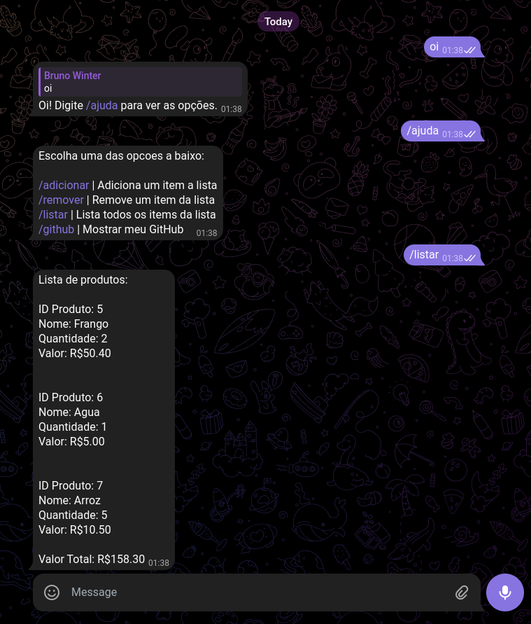

<p align="center">
<a href="https://git.io/typing-svg"></a>
</p>

## 📖 Descrição
* Projeto criado usando Python, TelegramBotAPI e PostgresSQL
* Adicionar, remover e listar produtos
* Soma total do valor dos produtos 

## 📷 Galeria


## 💻 Pré-requisitos
* Criar banco de dados
* Criar um Bot no Telegram para resgatar sua chave de API

### Banco de Dados
```
CREATE TABLE produto (
    id SERIAL PRIMARY KEY,
    nome VARCHAR(255) NOT NULL,
    valor NUMERIC(10,2) NOT NULL,
    quantidade INTEGER NOT NULL,
    id_telegram BIGINT
);
```
## 🚀 Futuras Atualizações

Este projeto poderá ser atualizado com as seguintes possibilidades:

- [ ] Criar API para se comunicar com o Banco
- [ ] Adicionar mais funcionalidades

## 🤖 Tecnologias


